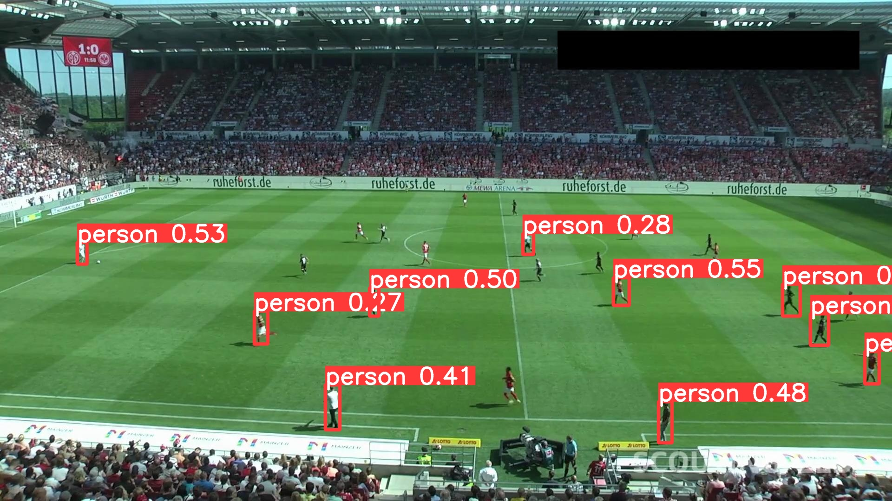

# Soccer players tracking with Yolov8

## Overview

This project focuses on fine tuning Yolov8 model for soccer players tracking using the dataset available <a href="https://universe.roboflow.com/roboflow-jvuqo/football-players-detection-3zvbc" target="blank">here</a>.

  
  
  <h6 align="center">
    Pretrained vs finetuned Yolov8 model prediction examples
  </h6>

## Requirements

- Python 3.10 or later
- Click
- PyTorch
- Yolov8